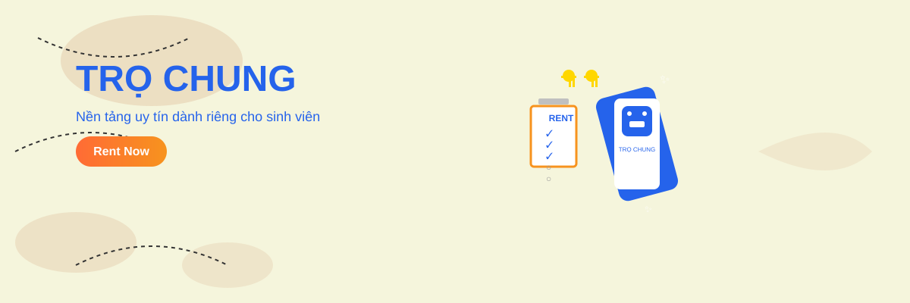

# Trọ Chung



**Trọ Chung** là nền tảng hỗ trợ tìm phòng trọ, tìm người ở ghép và quản lý quá trình thuê phòng. Dự án kết nối người thuê với chủ trọ trên cùng một hệ thống, từ tìm kiếm, đăng tin và đặt phòng cho đến thanh toán, trao đổi và quản lý hợp đồng thuê.

## Tính năng chính

### Người dùng

- Đăng ký, đăng nhập, xác minh email và khôi phục mật khẩu.
- Tìm kiếm, lọc và xem vị trí phòng trên bản đồ.
- Xem chi tiết phòng, đánh giá, bình luận và lưu phòng yêu thích.
- Đăng tin cho thuê phòng hoặc tìm người ở ghép.
- Đặt phòng, theo dõi phòng đang thuê và gửi yêu cầu trả phòng/gia hạn.
- Nạp tiền, thanh toán, rút tiền và xem lịch sử giao dịch.
- Trò chuyện và nhận thông báo theo thời gian thực.
- Gửi yêu cầu hỗ trợ đến quản trị viên.
- Tìm kiếm phòng phù hợp với nhu cầu bằng AI.

### Chủ trọ

- Đăng và quản lý phòng cho thuê.
- Quản lý bài đăng, yêu cầu đặt phòng, gia hạn và trả phòng.
- Theo dõi lịch sử thanh toán và các khoản thu liên quan.

### Quản trị viên

- Theo dõi số liệu tổng quan của hệ thống.
- Quản lý người dùng, bài đăng và yêu cầu hỗ trợ.
- Quản lý đặt phòng, tiền cọc, trả phòng sớm và yêu cầu rút tiền.

## Công nghệ sử dụng

| Thành phần | Công nghệ |
| --- | --- |
| Frontend | React 18, React Router, Redux Toolkit, Material UI, Bootstrap |
| Backend | Node.js, Express.js |
| Cơ sở dữ liệu | MongoDB, Mongoose |
| Thời gian thực | Socket.IO |
| Bản đồ | Leaflet, React Leaflet |
| Lưu trữ hình ảnh | Cloudinary |
| Xác thực | JWT, bcrypt, cookie HTTP-only |
| Thanh toán | VNPay, VietQR |
| AI | Google Gemini |
| Email | Nodemailer |
| Kiểm thử | Jest, React Testing Library |

## Cấu trúc dự án

```text
WDP301/
├── backend/
│   ├── controllers/       # Xử lý nghiệp vụ
│   ├── jobs/              # Tác vụ chạy định kỳ
│   ├── middleware/        # Xác thực và phân quyền
│   ├── models/            # Mô hình dữ liệu MongoDB
│   ├── routers/           # Các API endpoint
│   ├── services/          # Thanh toán và tìm kiếm AI
│   ├── test/              # Kiểm thử backend
│   └── server.js          # Điểm khởi chạy server
├── frontend/
│   ├── public/            # Tài nguyên tĩnh
│   └── src/
│       ├── Components/    # Component dùng chung
│       ├── config/        # Cấu hình Axios
│       ├── pages/         # Các trang của ứng dụng
│       ├── redux/         # Store và state toàn cục
│       └── services/api/  # Các hàm gọi API
└── README.md
```

## Cài đặt và chạy dự án

### Yêu cầu

- Node.js 18 trở lên
- npm
- MongoDB local hoặc MongoDB Atlas

### 1. Tải mã nguồn

```bash
git clone https://github.com/namkz107/TroChung.git
cd TroChung
```

### 2. Cấu hình backend

Cài đặt thư viện:

```bash
cd backend
npm install
```

Tạo file `backend/.env` và điền các giá trị phù hợp:

```env
# Bắt buộc
MONGO_URL=mongodb://localhost:27017/trochung
JWT_SECRET=replace-with-a-strong-secret
REFRESH_JWT_SECRET=replace-with-another-strong-secret

# Server và frontend
PORT=8000
NODE_ENV=development
FRONTEND_URL=http://localhost:3000

# Cloudinary - dùng cho tải ảnh/video
CLOUD_NAME=your-cloud-name
API_KEY=your-cloudinary-api-key
API_SECRET=your-cloudinary-api-secret

# SMTP - dùng cho xác minh email và đặt lại mật khẩu
SMTP_HOST=smtp.example.com
SMTP_PORT=465
SMTP_SECURE=true
SMTP_USER=your-email@example.com
SMTP_PASS=your-email-password
SMTP_FROM=your-email@example.com
APP_NAME=TroChung
SUPPORT_EMAIL=your-email@example.com

# Google Gemini - dùng cho tìm kiếm bằng AI
APIGeminiKey=your-gemini-api-key

# Cấu hình thanh toán (tùy chọn)
VNP_TMNCODE=your-vnpay-terminal-code
VNP_HASHSECRET=your-vnpay-secret
VNP_URL=https://sandbox.vnpayment.vn/paymentv2/vpcpay.html
VNP_RETURNURL=http://localhost:3000/vnpay_return
BANK_ID=your-bank-id
ACCOUNT_NO=your-account-number
BANK_ACCOUNT_NAME=your-account-name
BANK_TEMPLATE=compact
```

> Không đưa file `.env` hoặc thông tin bí mật lên Git.

Khởi chạy backend:

```bash
npm run dev
```

Backend mặc định chạy tại `http://localhost:8000`.

### 3. Cấu hình frontend

Mở một terminal khác:

```bash
cd frontend
npm install
npm start
```

Frontend chạy tại `http://localhost:3000`. Trong môi trường phát triển, các yêu cầu API được chuyển tiếp đến `http://localhost:8000` thông qua cấu hình proxy.

Nếu frontend và backend chạy trên các địa chỉ khác, tạo file `frontend/.env.local`:

```env
REACT_APP_API_URL=http://localhost:8000
REACT_APP_SOCKET_URL=http://localhost:8000
```

## Các lệnh thường dùng

### Backend

```bash
npm run dev      # Chạy server với nodemon
npm start        # Chạy server bằng Node.js
npm test         # Chạy kiểm thử backend
```

### Frontend

```bash
npm start        # Chạy ứng dụng ở chế độ phát triển
npm run build    # Tạo bản build production
npm test         # Chạy kiểm thử frontend
```

## API chính

Backend cung cấp các nhóm API dưới tiền tố `/api`:

- `/api/auth` - xác thực người dùng
- `/api/users` và `/api/user-info` - người dùng và hồ sơ
- `/api/posts` và `/api/rooms` - bài đăng và phòng
- `/api/favorites`, `/api/comments`, `/api/ratings` - tương tác với phòng
- `/api/bookings` - đặt và thuê phòng
- `/api/payments` và `/api/withdrawals` - thanh toán và rút tiền
- `/api/chat` và `/api/notifications` - trò chuyện và thông báo
- `/api/support` - hỗ trợ người dùng

## Đóng góp

1. Tạo nhánh mới từ nhánh phát triển của nhóm.
2. Thực hiện thay đổi và kiểm thử trên máy cá nhân.
3. Viết commit ngắn gọn, mô tả rõ nội dung thay đổi.
4. Tạo pull request để các thành viên khác review trước khi merge.

---

Dự án được thực hiện trong khuôn khổ môn **WDP301**.
